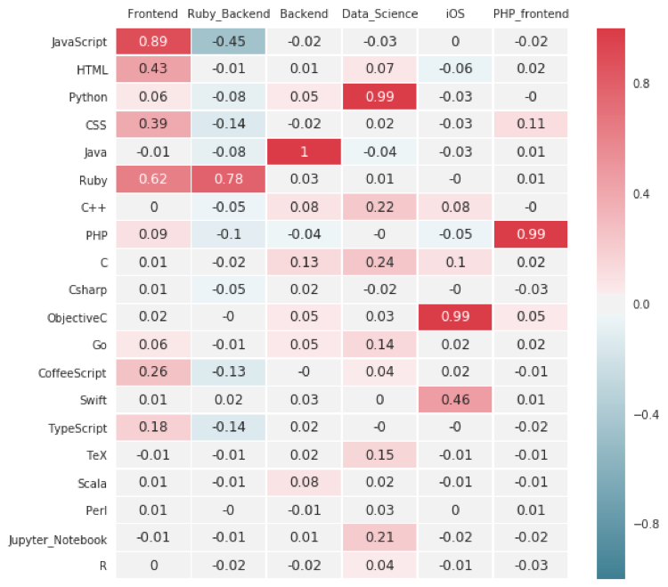
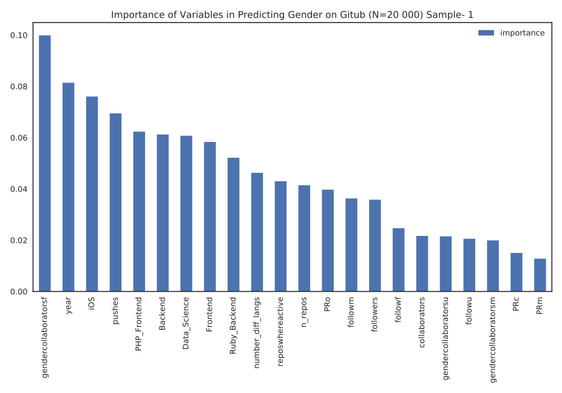
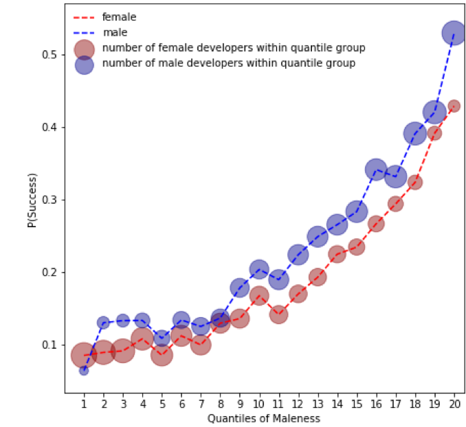
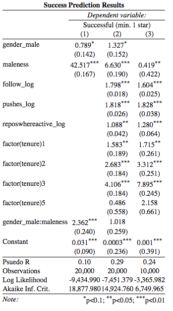

# Gendered Success in Developer Careers

## Problem
While women have been shown to make vital contributions to the collective intelligence of teams (Wooley-Williams et al., 2010), they are also marginalized in many respects. (Gill, 2002; Terrell et al., 2016) In project-based creative fields investing in social capital by sharing knowledge with other experts is an important aspect of a successful career, and men seem to do a better job at it. (Lutter, 2015) To test this hypothesis in IT, we analyzed the paths to success for men and women using their activity traces on GitHub. 

## Data Collection
Our primary data source is GitHub  the most popular online Open Source community, which is a modern platform for the development of social and knowledge capital (Bonaccorsi and Rossi, 2003). The empirical basis of this work is a data set acquired via githubarchive.org about the activities on the social coding platform GitHub, encompassing the various types of events that took place between 2009 and 2016. 
To collect information about users’ name, e-mail address, location, organizations, number of followers, number of people they follow, number of public repositories and the date they joined GitHub, we sent calls to the official GitHub  users API  

## Gender Recognition
Since users do not list their gender directly, we infer each person's gender using their first names. This is a commonly and successfully used method in Western societies (Hannak et al, 2017) In this work, we relied on the US baby name dataset (SSA 2016).  Due to some names being used for both males and females, we assign a probability of being male to each candidate based on the fraction of times their first name was assigned to a male baby in the name dataset. The bimodal shape of this probability distribution, sharply peaking at 0 and 1, allows us to binaries the values using the thresholds 0.1 and 0.9: If the probability is less than 0.1 or equal we assign the user as female, if it is higher than 0.9 or equal we assign as male, otherwise unknown. 

### Gender Recognition Summary

| Probability                        | Gender   | Sample Size  |
| ---------------------------------- | -------- | ------------ |
| P <= 0.1                           | female   | 180 000      |
| No name available or 0.1 < P < 0.9 | unknown  | 6.2 million  |
| P >= 0.9                           | male     | 1.4 million  |

We used collaboration activity to conceptualize individual careers. After filtering for users with at least 10 actions we created stratified samples of each gender group, With 10,000 male, female, and unknown users. This short summary shows results of the first sample.

## Career Path Identification

For each repository, GitHub auto-detects the main language of every repository based on its linguist library. We extracted more than 100 different programming languages, and kept the 20 most common ones. 

Programming is a very diverse field, with different career tracks, such as frontend and backend development, data science or system engineering. Each field has its own favored language combinations, for instance data scientist are more likely to use Python, R, SQL, Jupyter Notebooks and Julia.
We used Principal Component Analysis to identify the correlation structure within the language preference and identify career tracks. We used Scipy’s PCA.decomposiation package with Varimax Rotation to identify independent factors. (Pedragosa et al; 2011)

Correlation matrix shows the "importance"  and sign of the relationship of each language in the given components. We identified 6 main components; 1) Frontend development (JavaScript, HTML, CSS, Ruby), 2) Developers using Ruby mainly for backend problems (strong positive Ruby and quite negative JavaScript), 3) Backend Development with high activity in Java, 4) Data Science (Python, Jupyter Notebook, R, C++), 5) iOS development (Objective C, Swift) and 6) PHP enthusiastic with Frontend focus (PHP,CSS).

## Maleness

We adapted an approach pioneered by Wachs and co-authors (Wachs et al. 2017) to operationalize the extent to which someone’s behavior follows a gendered pattern, using the resulting continuous variable to consider a continuum, rather than binary, notion of gendered behavior. For measuring gendered behavior, we used a Random Forest model (Pedragosa et al; 2011) to predict the gender of a user, using their collaboration history, activity, and field(s) works on. The variable importance plot give us a measure of how gendered a given kind of activity or field is.

### Variable Importance

Our final model has a moderate accuracy (AUC=0.71), meaning there is no perfect classification based on career tracks, user activity and collaboration history to predict gender. We also run a logistic regression model to understand the sign of the relationship between gender and each language, for more details check the model . Both the Random Forest and the Logit Model revealed that gender homophily is more likely among women, the number of female collaborators is the most important indicator of gender prediction on GitHub.

### Gender and Success

On GitHub the number of stars on users’ own repositories defines success. We used the gender prediction results (maleness) to understand the correlation between success and gendered behavior. We call successful a developer if s/he has at least one star, because less than 20 percent of active users has at least 1 star.

Maleness is positively related with success, but female developers are systematically less successful, even if they have highly male behaviors. (Red line is always under the blue one.) 

To understand the effect of gendered behavior deeper, we ran 3 logistic regression models with dependent variable 'success'.
We use an odds ratio to calculate represents the odds that the user is successful and having a given attribute (e.g.: being male or adopting male-like behavior) compared to the odds of being not successful in the absence of that given attribute (being a women, or not adopting male-like behavior). Significance stars in the table below denote p<0.05.

The control model shows that maleness has a very strong effect on success (OR=42,52), but the model has quite a weak fit (Pseudo R square = 0.10). Maleness becomes less dominant in the second model, where we controlled for activity (pushes, number of repositories, where the user was active) and popularity (number of followers) and tenure. The model fits better (R2= 0.29). At the third model, where we only predicted success for users whose gender could not have been inferred. Third model shows that maleness has a negative, but significant effect in success (OR=0.4) and tenure and activity become stronger indicators. It seems that the 'hiding gender' population uses different mechanism to achieve community reputation.

## Closure

Research shows that in a majority-minority setting the marginalized group should avoid closing itself into cohesive groups, and needs to invest into diverse collaborations to be successful in long term (Lutter, 2015). We ca conclude that women are more likely to collaborate with each other, but more likely to succeed if they adopt a collaboration and activity behavior that is typical of men. For instance, they are more likely to be successful if they collaborate less with other women. 
An important reason why this work is innovative is that it one of the few gendered studies which aim to computationally understand causes and consequences of female marginalization in technology. We are also able to distill our findings and offer practical advice for young professionals. 

## References
*	Bonaccorsi, A. and Rossi, C. (2003). Why Open Source software can succeed. Res. Policy, 32:1243–1258. 
*	Gill, R. (2002). Cool, Creative and Egalitarian? Exploring Gender in Project-Based New Media Work in Euro. Information, Commun. Soc., 5(1):70–89. 
*	Hannak, A., Wagner, C., Garcia, D., Mislove, A., Strohmaier, M., and Wilson, C. 2017. Bias in Online Freelance Marketplaces: Evidence from TaskRabbit and Fiverr. In 20th ACM Conference on Computer-Supported Cooperative Work and Social Computing (CSCW 2017).
*	Lutter, M. (2015). Do Women Suffer from Network Closure? The Moderating Effect of Social Capital on Gender Inequality in a Project-Based Labor Market, 1929 to 2010. Am. Sociol. Rev., 80(2):329–358. 
*	Fabian Pedregosa, Gaël Varoquaux, Alexandre Gramfort, Vincent Michel, Bertrand Thirion, Olivier Grisel, Mathieu Blondel, Peter Prettenhofer, Ron Weiss, Vincent Dubourg, Jake Vanderplas, Alexandre Passos, David Cournapeau, Matthieu Brucher, Matthieu Perrot, Édouard Duchesnay. (2011) Scikit-learn: Machine Learning in Python, Journal of Machine Learning Research, 12, 2825-2830 
 *	Terrell, J., Kofink, A., Middleton, J., Rainear, C., Murphy-Hill, E., and Parnin, C. (2016). Gender bias in open source: Pull request acceptance of women versus men. PeerJ Prepr. 
*	Wachs, J., Hannakm A., Voros, A., Daroczy, B. (2017) Why Do Men Get More Attention? Exploring Factors Behind Success in an Online Design Community
Proceedings of the 11th International AAAI Conference on Weblogs and Social Media (ICWSM'17), Montreal, May, 2017.
*	Wooley-Williams, A., Chabris, C. F., Pentland, A., Hashmi, N., and Malone, T. M. (2010). Evidence for a Collective Intelligence Factor in the Performance of Human Groups. Science (80-. )., 330. 

